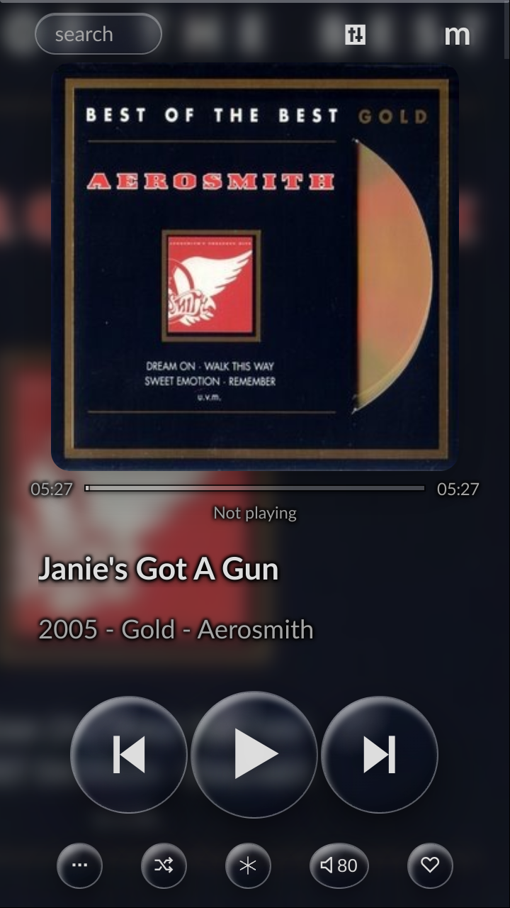
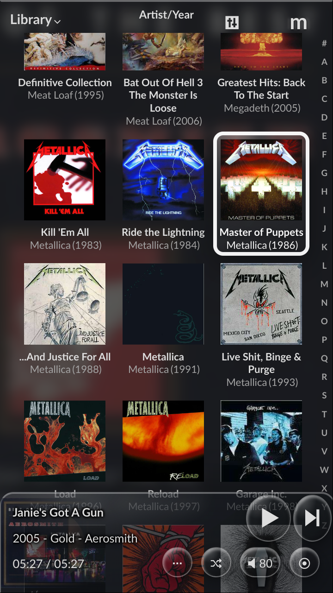
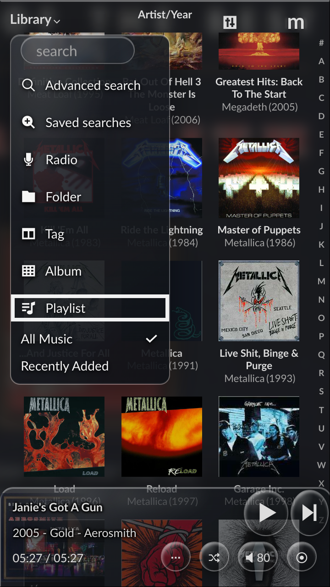

# Liquid Glass theme for moOde Audio

This patch adds **Liquid Glass** to moOde's existing theme selector. It provides
transparent rounded surfaces, tint-free glass controls, readable metadata over
cover artwork, lightweight glass menus, optimized Library scrolling, and a matching transparent focus
style when the optional SiriRemote navigation patch is installed. The Album,
Radio, Playlist, Folder, and Tag views retain moOde's native compact playbar
layout, while its existing Play/Pause, Next, volume, and toggle controls use the
same round glass material as the fullscreen Playback controls. Footer controls
have an explicit square minimum and the desktop Previous/Play/Next controls use
fixed square boxes, preventing circular buttons from becoming vertically oval
on wider phone, tablet, and computer layouts.

The project is independent of SiriRemote. It can be installed on a normal
moOde system and selected from **Preferences → Appearance → Theme**, just like
the themes supplied with moOde. Because the selected moOde theme is read from
the server, the styling applies both to the local display and to network
browsers on a phone, tablet, or computer. Reload an already-open browser once
after installation. SiriRemote's command feedback overlay is deliberately not
part of this theme and remains local to the Raspberry Pi display.


<br><sub>Playback with tint-free glass controls and readable metadata over moOde's cover backdrop.</sub><br><br>

<p>
  
  
</p>
<sub>The current optimized Album grid, responsive glass playbar, and static-glass Library menu. The white focus frame is supplied by the optional SiriRemote navigation integration.</sub><br><br>

## What the patch changes

The installer:

1. adds one `Liquid Glass` row to moOde's `cfg_theme` table;
2. installs `liquid-glass-theme.css` and `liquid-glass-theme.js` below
   `/var/www`;
3. adds one clearly marked CSS/JavaScript include block to
   `/var/www/header.php`;
4. stores the previously active theme and selects Liquid Glass by default;
5. creates timestamped safety backups below
   `/var/backups/moode-liquid-glass-theme`.

No additional package is installed. The CSS is applied only while moOde's
active theme is `Liquid Glass`; choosing another theme in the GUI immediately
disables it. The database row supplies the standard moOde base colours, while
the separate stylesheet provides effects that cannot be represented by
moOde's four native theme colour fields. While a Library grid is visible, the
theme keeps its glass gradients, rims, and shadows but suspends live backdrop
blur on the fixed header, footer, and footer buttons. This avoids repeatedly
re-blurring the moving album grid and makes touch scrolling more consistent.
Dropdown menus use opaque-enough static gradients, strong text contrast, and
no live backdrop blur, so their appearance does not add scrolling overhead.
Native select popups use an explicit high-contrast row palette, while moOde's
custom Theme chooser retains each theme's own background/text preview colours.
This keeps both light previews such as Green Tea and dark previews readable.
The fixed Library playbar likewise uses a static dark glass fill: underlying
album labels cannot interfere with its metadata or controls, without requiring
the moving album grid to be blurred every frame.

## Install

```sh
git clone https://github.com/mischamol/moOdeAudioProjects.git
cd moOdeAudioProjects/LiquidGlassTheme
sudo sh ./install.sh
```

To register the theme without selecting it immediately:

```sh
sudo sh ./install.sh --no-activate
```

Open **Preferences → Appearance → Theme** and select **Liquid Glass**. Reload a
network browser if it was already open. The local display is reloaded by the
installer.

After a moOde update, run the same installer again. It is idempotent and
reapplies only its own marked include block and database entry.

## Uninstall

```sh
cd moOdeAudioProjects/LiquidGlassTheme
sudo sh ./uninstall.sh
```

If Liquid Glass is active, the uninstaller restores the theme that was active
before the first installation (or `Default` if that theme no longer exists).
It removes only its own two web assets, marked header block, database row, and
small previous-theme state file. Safety backups are retained.

## Compatibility

The patch supports both moOde source headers containing `scripts-panels.js` and
release headers containing the bundled `main.min.js`. It was developed against
moOde on Raspberry Pi OS Trixie and a 720 × 1280 portrait local display. The
layout remains responsive and is not tied to that resolution.
